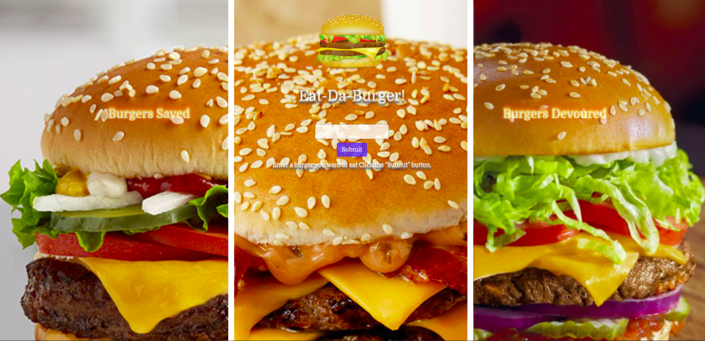

# Eat-Da-Burger 2: The Sequel

An **Optional** Sequelize Full-stack assignment.
___
In this assignment, I was tasked with creating a sequelized version of the very awesome [Eat-Da-Burger](https://github.com/armonkahil/burger) burger logging app.

Deployed on [Heroku](https://polar-lake-43271.herokuapp.com/)

### Technologies used:
- Sequelize
- Sequelize-CLI
- Node.js
- Mysql
- Express
- Express-handlebars
- Chalk
- Heroku
- JawsDB
- Jquery
- AnimateCSS
- Google Fonts

